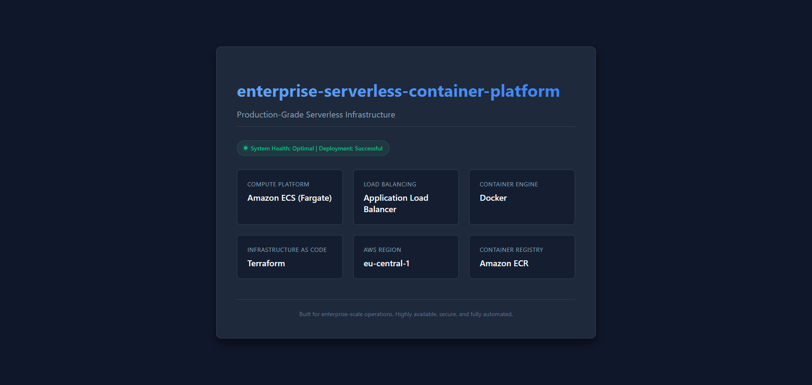

<div align="center">
  <h1 align="center">Enterprise Serverless Container Platform</h1>
  <h3>Production-Grade AWS Infrastructure deployed with Terraform & Docker</h3>
</div>

<p align="center">
  
  
  
  
  
  
</p>

---

## 📖 Project Overview
This repository contains the complete Infrastructure as Code (IaC) to provision a highly available, enterprise-grade serverless container platform on AWS. Built from the ground up using **Terraform**, this project autonomously creates the networking, security, compute, and load balancing layers, and deploys a Dockerized frontend using **Amazon ECS on AWS Fargate**.

## ✨ Key Features
- **Zero-Touch Deployment**: 100% automated using Terraform (`apply` creates everything, including Docker builds).
- **Serverless Compute**: Fully managed compute environment using AWS Fargate (no EC2 instances to maintain for the application).
- **Native Automated Builds**: Uses a temporary EC2 builder to securely build and push Docker images to Amazon ECR directly inside the VPC.
- **High Availability**: Multi-AZ deployment (eu-central-1a & eu-central-1b) behind an Application Load Balancer.
- **Enterprise Security**: Least privilege IAM roles, secure networking, isolated Security Groups, and no public credentials.

---

## 🏛 Architecture Overview

<div align="center">
  
</div>

### 🛠 AWS Services Used
- **VPC (Virtual Private Cloud)**: Custom network with public subnets and internet gateways.
- **Application Load Balancer (ALB)**: Intelligent traffic routing to healthy containers.
- **Amazon ECS & Fargate**: Serverless container orchestration.
- **Amazon ECR**: Private Elastic Container Registry.
- **CloudWatch Logs**: Centralized application logging.
- **IAM**: Secure role-based access control.

---

## 📂 Repository Structure
```text
.
├── .gitignore
├── README.md
├── architecture/
│   └── diagram.mermaid
├── docker/
│   ├── Dockerfile
│   ├── buildspec.yml
│   └── index.html
├── screenshots/          # Evidence of successful deployment
└── terraform/
    ├── alb.tf            # Application Load Balancer
    ├── ecr_builder.tf    # ECR & Native EC2 Image Builder
    ├── ecs.tf            # ECS Cluster & Fargate Task
    ├── iam.tf            # IAM Roles & Policies
    ├── main.tf           # Provider config
    ├── network.tf        # VPC, Subnets, Routing, SGs
    ├── outputs.tf        # URL Exports
    └── variables.tf      # Environment variables
```

---

## 🔒 Security Features
- **IAM Least Privilege**: Tasks and builder instances only possess permissions explicitly required for their operations.
- **No Secrets Stored**: Designed entirely without static AWS credentials. Uses instance profiles.
- **Network Isolation**: The ECS tasks only accept incoming HTTP traffic from the ALB, preventing direct internet access.

---

## 🚀 Deployment Workflow
1. **Initialize**: `terraform init` prepares the modules and providers.
2. **Validate**: `terraform validate` ensures code quality.
3. **Apply**: `terraform apply -auto-approve` executes the infrastructure plan.
4. **Build Phase**: A temporary EC2 instance is spun up to build the Docker image natively from the `docker/` folder and push it to ECR.
5. **Run Phase**: The Fargate service starts the container, registers it with the ALB Target Group, and begins serving traffic.

---

## 📸 Screenshots Gallery
Below are screenshots capturing the successfully deployed infrastructure:

<details>
<summary>Click to view AWS Infrastructure Screenshots</summary>

- **Amazon ECR Registry**: <br> 
- **ECS Cluster Metrics**: <br> 
- **ECS Service Configuration**: <br> 
- **ECS Service Events**: <br> 
- **ECS Services**: <br> 
- **ECS Tasks**: <br> 
- **CloudWatch Logs (Event Detail)**: <br> 
- **CloudWatch Logs**: <br> 
- **ALB Configuration**: <br> 
- **ALB Security Group**: <br> 
- **ECS Security Group**: <br> 
- **ALB Target Group**: <br> 
- **VPC Configuration**: <br> 
- **Deployed Landing Page (HTTP)**: <br> 

</details>

---

## 💻 How to Deploy
Ensure your local environment has the AWS CLI installed and configured.

```bash
git clone https://github.com/eng-imonmahmud/enterprise-serverless-container-platform.git
cd enterprise-serverless-container-platform/terraform
terraform init
terraform apply -auto-approve
```

## 🧹 How to Destroy
To prevent unexpected AWS charges, clean up the resources when finished:
```bash
cd terraform
terraform destroy -auto-approve
```

---

## 💡 Lessons Learned
- Engineering a robust, self-contained automated Docker builder (via EC2 user-data) gracefully bypassing account-level CodeBuild restrictions (common in free-tier environments).
- Securing Terraform configurations to cleanly depend on dynamically generated container images.

## 🚀 Future Improvements
- Migration to a fully automated CI/CD pipeline using **GitHub Actions**.
- Adding HTTPS termination via **AWS ACM** and **Route53**.
- Implementing **Auto Scaling** rules based on CPU/Memory utilization to dynamically manage load.

---

## 👨‍💻 Author
**Imon Mahmud**  
*IT SPECIALIST | CLOUD INFRASTRUCTURE & AI AUTOMATION ENGINEER*

- **GitHub Profile**: [eng-imonmahmud](https://github.com/eng-imonmahmud)

---
<p align="center">
  <i>Portfolio Highlights - Built for enterprise scale, security, and high availability.</i>
</p>
